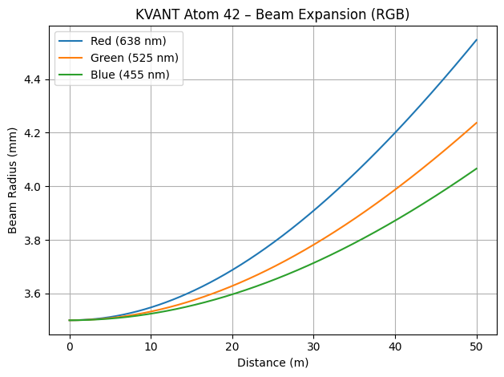
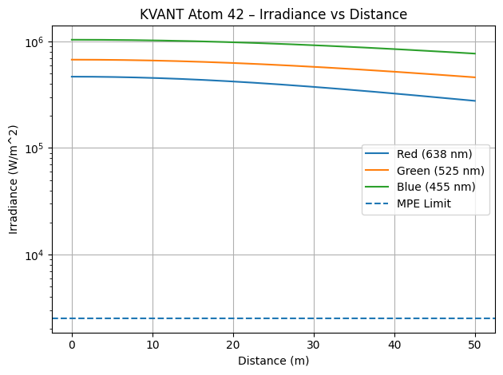
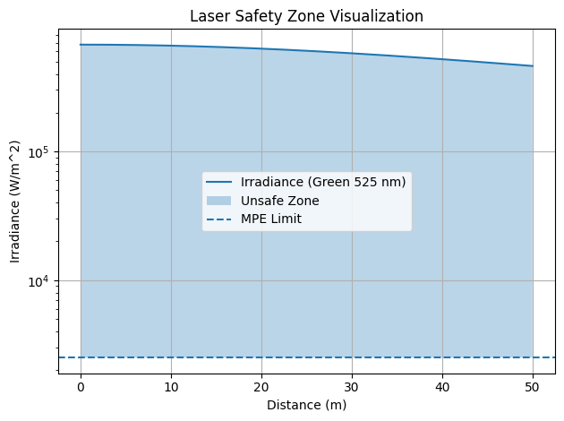

# Laser Beam Profiling & Safety Analysis  
### (KVANT Atom 42 – Simulation-Based Study)

## 📌 Overview
This project presents a simulation-based analysis of Gaussian beam propagation using parameters inspired by the KVANT Atom 42 high-power laser system used in large-scale entertainment installations.

The study focuses on beam expansion, irradiance variation, wavelength-dependent behavior (RGB), and laser safety evaluation based on simplified IEC standards.

---

## 🎯 Objectives
- Model Gaussian beam propagation in free space  
- Analyze irradiance decay with distance  
- Compare RGB wavelength behavior  
- Evaluate laser safety using MPE threshold  
- Approximate IEC 60825 laser classification  

---

## ⚙️ System Parameters (KVANT Atom 42)
- Beam Diameter: **7 mm**
- Wavelengths:
  - Red: 638 nm  
  - Green: 525 nm  
  - Blue: 455 nm  
- Output Power:
  - Red: 9 W  
  - Green: 13 W  
  - Blue: 20 W  

---

## 🧠 Methodology
The simulation is implemented in Python using:
- NumPy (numerical computation)
- Matplotlib (visualization)

Key equations used:
- Gaussian beam propagation
- Rayleigh range
- Irradiance distribution
- Beam divergence

A simplified Maximum Permissible Exposure (MPE) model is used to estimate safety zones.

---

## 📊 Results

### 🔹 Beam Expansion (RGB)

### 🔹 Irradiance (Log Scale)

### 🔹 Safety Zone Visualization

---

## ⚠️ Safety Analysis
- Irradiance near the source exceeds MPE limits  
- Unsafe exposure zones identified  
- System behavior corresponds to **Class 4 laser category**

> Note: Classification is an approximation and does not replace formal IEC evaluation.

---

## 📁 Project Structure
laser-beam-profiling-kvant/
│
├── laser_simulation.py
├── README.md
└──report.pdf

---

## 🚀 Applications
- Laser safety analysis  
- Photonics education  
- Engineering simulations  
- Entertainment laser system design  

---

## 🔮 Future Work
- NOHD (Nominal Ocular Hazard Distance) calculation  
- 3D beam intensity visualization  
- Integration with IEC 60825 standards  
- Real-time sensor-based safety monitoring  

---

## 👤 Author
**Abdul Moeed**  
Electronic Engineer | Automation & Control  

---

## 📌 Notes
This project is developed for educational and analytical purposes using publicly available specifications. It does not represent proprietary system design.
